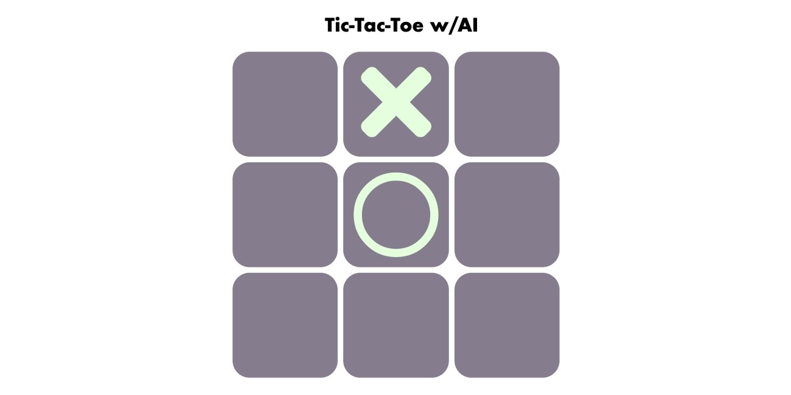

# Tic-Tac-Toe with AI

This is a simple implementation of Tic-Tac-Toe with an AI opponent. The game allows you to play as 'X' and compete against the computer, which plays as 'O'. The AI makes its moves based on a set of predefined rules to provide a challenge.

## Table of Contents
- [Features](#features)
- [Getting Started](#getting-started)
- [How to Play](#how-to-play)
- [Technologies Used](#technologies-used)
- [License](#license)

## Features
- Play as 'X' against an AI opponent ('O').
- A basic AI that follows certain rules for making moves.
- Option to start a new game and play again.
- Display of game results, including a win, loss, or a scratch (draw).
- Easy-to-understand JavaScript code for game logic.

## Getting Started
To play this game, follow these steps:

1. Clone this repository to your local machine.
2. Open the `index.html` file in a modern web browser.
3. Choose to play as 'X' or 'O' by clicking the respective button.
4. Click on an empty square in the grid to make your move.
5. The AI opponent ('O') will take its turn automatically.
6. Continue taking turns until the game ends.

## How to Play
- Click on the "Play as X" or "Play as O" button to start the game.
- When it's your turn (the 'X' player), click on an empty square on the board to make your move.
- The AI opponent will automatically make its move after your turn.
- The game continues until one player wins or the game ends in a draw.

## Screenshots

## Technologies Used
- HTML
- CSS
- JavaScript